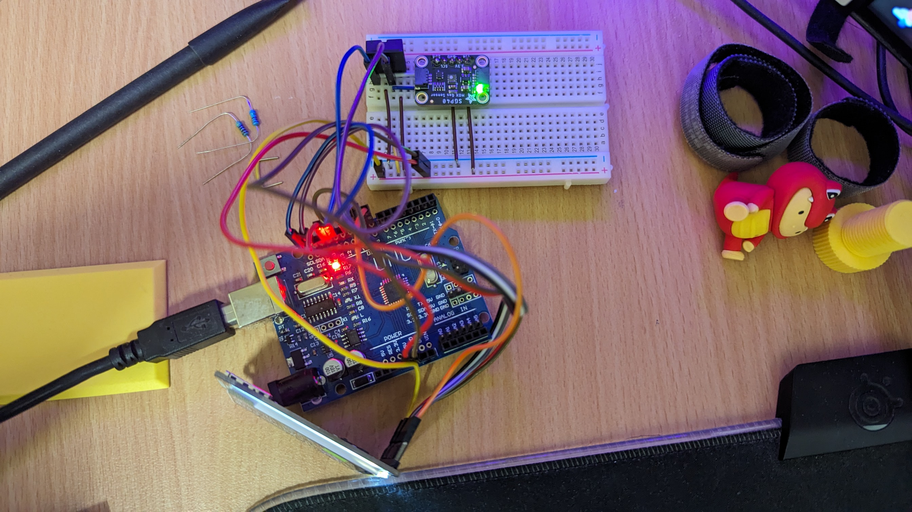
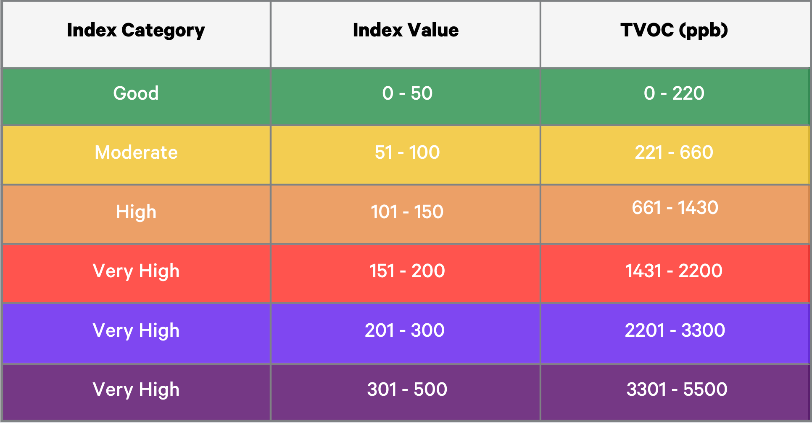

# Arduino-Air-Quality-Monitor
Air quality, humidity and room temperature sensor and display

  

  

The sensor returns TVOC(ppb) reading, and the danger category colouring refers to AQI's guide, with the range shifted in the downward direction for early warning

  

## Parts used

| Parts | Usage | Reference link |
|-------|-------|----------------|
|Adafruit SGP40 air quality sensor|to measure VOC index|[link](https://www.digikey.com.au/en/products/detail/adafruit-industries-llc/4829/13561761?so=83313386&content=productdetail_AU)|
|Adafruit 2.0" 320X240 Color IPS TFT Display|display live readings without the need of a PC|[link](https://www.digikey.com.au/en/products/detail/adafruit-industries-llc/4311/10313914?so=83313386&content=productdetail_AU)|
|Adafruit digital temperature and humidity|to measure room temperature and humidity|[link](https://www.digikey.com.au/en/products/detail/adafruit-industries-llc/3721/8558266?so=83313386&content=productdetail_AU)
|Arduino R3|microprocessor|N/A|
|Breadboard|to attach sensors and wire them up|N/A|

## Schematics

The chosen display uses SPI communication protocol, however you may opt to get one using I2C instead

## Dependencies

This project uses the following libraries. Download, unzip and add them to arduino IDE, this [guide](https://docs.arduino.cc/software/ide-v1/tutorials/installing-libraries/) may help for the installation:

- [Adafruit's AM2320](https://github.com/adafruit/Adafruit_AM2320)
- [Adafruit's SGP40](https://github.com/adafruit/Adafruit_SGP40)
- [Adafruit's GFX](https://github.com/adafruit/Adafruit-GFX-Library)
- [Adafruit's ST7735/7789](https://github.com/adafruit/Adafruit-ST7735-Library)
- [Adafruit's DHT sensor library](https://github.com/adafruit/DHT-sensor-library)

## Known Limitations

- TVOC sensors need some time (~5 minutes) to calibrate and get to the right reading at each start up
- For efficiency and memory management, the screen only update in a 3 seconds interval. The updating screen is indicated by the white dot that will appear on the top right.
